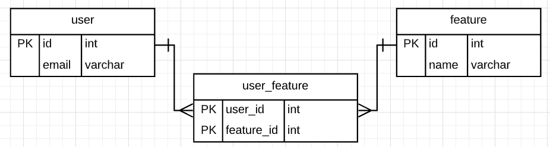

# moneylion-feature-switches

Take home assigment from MoneyLion completed by Vincent Chee Jia Hong.

## Requirements

Build two APIs that can

1) Determine whether a feature is enabled for particular user
2) Enable or disable feature for particular user

## Implementation discussion

### Schema



- A user can be associated with number of features. Conversely, the same feature can be owned by several users. We can
  model this into a many-to-many relationship.
- First, we need `user` and `feature` tables to store user email and feature name.
- Later, create a `user feature` table that takes user id and feature id as composite primary key.
- An entry will be inserted to this table if some feature is switched on for a particular user.
- An entry will be removed if the feature is being switched off.
- Determine a feature is enabled for a particular user is just making existence checking in `user feature` table.

### Code highlight

1) Implement many-to-many relationship through the `JoinTable` annotation.

```java
@JoinTable(name = "user_feature",
        joinColumns = {
                @JoinColumn(name = "user_id")
        },
        inverseJoinColumns = {
                @JoinColumn(name = "feature_id")
        }
)
private Set<Feature> features = new HashSet<>();
```

- This provides us the ability to determine a feature is enabled by checking whether the feature is in the set. <p/>
  Example:

```java
user.getFeatures().contains(feature)
```

2. Returning status code `NOT_MODIFIED` when no change is made.

- This happens when the request to change == switch status.

```java
boolean isSwitchOn = user != null && feature != null && user.getFeatures().contains(feature);

boolean willNotModify = isEnable == isSwitchOn;

if (willNotModify) {
    throw new ResponseStatusException(HttpStatus.NOT_MODIFIED, "Resource is not updated.");
}

```